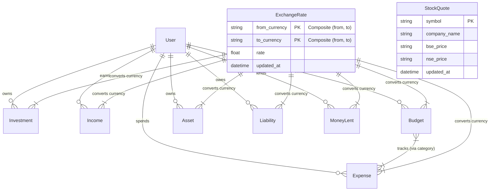

# Database Analysis & Schema Mapping

## Overview
- **Database Engine**: Defaults to **SQLite** (`db.sqlite3`) for development. Can be configured for **PostgreSQL** (or others) via `DATABASE_URL` environment variable using `dj_database_url`.
- **ORM**: Django ORM (Object-Relational Mapping).
- **Primary Keys**: Default Django auto-incrementing big integers (`id`).
- **Authentication**: All user-specific data is linked to the standard Django `User` model via Foreign Key.

## Entity-Relationship Diagram (ERD)

## Schema Details

### 1. Global & Utility Tables

| Table | Component | Description |
| :--- | :--- | :--- |
| **StockQuote** | `finance_stockquote` | **Cache for Live Data**. Stores latest stock prices fetched from Indian API. - `symbol` (Unique) - `bse_price`, `nse_price` (Strings, likely to preserve precision or format) - `updated_at` |
| **ExchangeRate** | `finance_exchangerate` | **Currency Conversion Logic**. Stores rates (e.g., QAR to INR). - `from_currency`, `to_currency` (Unique Together) - `rate` (Float) - Used dynamically by other models to calculate INR values. |

### 2. User Finance Domain

All tables below have a `user` Foreign Key to `auth_user` (Cascade Delete).

#### A. Income & Expense
| Model | Fields | Key Logic |
| :--- | :--- | :--- |
| **Income** | `source`, `category` (Salary, etc.), `amount`, `currency`, `date`, recurrence fields (`is_recurring`, `next_occurrence`) | `get_amount_in_inr()`: Runtime conversion using `ExchangeRate`. |
| **Expense** | `title`, `amount`, `category` (Food, etc.), `currency`, `date` | `get_budget_for_category()`: Finds active budget for the expense date/category. |
| **Budget** | `category`, `allocated_amount`, `currency`, `period` (Monthly, etc.), `start_date`, `end_date`, `is_active` | **Self-Contained Logic**: Calculates `spent`, `remaining`, and `utilization %` by querying `Expense` table derived from matching categories. |

#### B. Net Worth Components
| Model | Fields | Key Logic |
| :--- | :--- | :--- |
| **Investment** | `name`, `symbol` (Optional), `type`, `qty`, `current_value`, `purchase_value`, `currency` | Tracks assets like Stocks/Gold. `symbol` allows mapping to live prices if implemented (though currently `StockQuote` exists independently). |
| **Asset** | `name`, `type` (Property, Vehicle, Bank Account), `value`, `currency`, `account_number`, `bank_name` | Represents physical assets or bank balances. |
| **Liability** | `name`, `type` (Loan, Credit Card), `principal_amount`, `current_balance`, `interest_rate`, `monthly_payment`, `due_date`, `status` | Contains logic to calculate `paid_amount` and `completion_percentage`. |
| **MoneyLent** | `borrower_name`, `amount_lent`, `amount_returned`, `status`, `expected_return_date` | Auto-updates `status` (Active/Fully Returned) based on repayment. |

## Data Storage & Flow Strategy

1.  **Normalization**:
    *   The schema is **semi-normalized**. Currency logic is centralized in `ExchangeRate`.
    *   Categories (Income/Expense/Asset) are hardcoded as **Choices** in Django models, not separate tables.

2.  **Currency Handling**:
    *   **Base Currency**: The application implies **INR** is the base currency for reporting.
    *   **Dynamic Conversion**: Models store the *original* currency (e.g., QAR) and amount. Methods like `get_value_in_inr()` query the `ExchangeRate` table at runtime to provide normalized totals.

3.  **Caching (Stock Quotes)**:
    *   `StockQuote` acts as a persistant cache.
    *   **Flow**: Scheduler fetches data -> updates `StockQuote` -> `Investment` views (potentially) read this or just use user-provided `current_value`. *Note: The context suggests the scheduler updates quotes, but the Investment model has a `current_value` field which might be manually updated or synced.*

4.  **Budgets vs. Expenses**:
    *   **Loose Coupling**: Budgets and Expenses are linked strictly by the **String Category** (`category` field).
    *   **Analysis**: Budget utilization is calculated on-the-fly by summing expenses that match the budget's category and date range.
